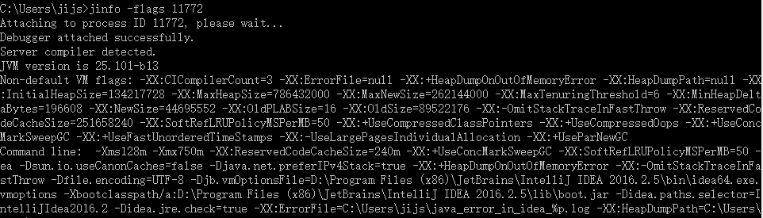
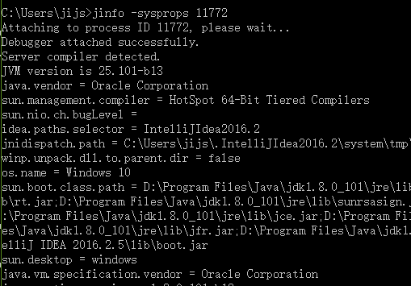

# JInfo 使用技巧

## 命令详解
### 1. 命令描述
#### 1.1 命令格式

> `jinfo [ option ] pid `</br>
> `jinfo [ option ] executable core` </br>
> `jinfo [ option ] [server-id@]remote-hostname-or-IP`

#### 1.2 简介
> jinfo prints Java configuration information for a given Java process or core file or a remote debug server. Configuration information includes Java System properties and Java virtual machine command line flags. If the given process is running on a 64-bit VM, you may need to specify the -J-d64 option, 

>e.g.: jinfo -J-d64 -sysprops pid
>
> 参考链接 [jdk8_jinfo](https://docs.oracle.com/javase/8/docs/technotes/tools/unix/jinfo.html#BCGEBFDD)

大意就是 `jinfo` 是java虚拟机自带的Java配置信息工具，可以为一个给定的Java进程或核心文件或一个远程调试服务器打印Java配置信息。
配置信息包括Java系统属性和Java虚拟机命令行标志。</br>
如果给定的进程在64位虚拟机上运行，你可能需要指定 -J -d64选项，例如: jinfo -J -d64 -sysprops pid


只有 `manageable` 级别的参数才能被 `jinfo` 调整. </br>
查询`manageable` 级别的命令
> `java -XX:+PrintFlagsInitial | grep manageable`

摘自 `Zuul JDK`

| type |            property name        |  default |     level    |
| ---  |              ---                |   ---    |      ---     |
| intx | CMSAbortablePrecleanWaitMillis  |  = 100   | {manageable} |
| intx | CMSTriggerInterval              |  = -1    | {manageable} |
| intx | CMSWaitDuration                 |  = 2000  | {manageable} |
| bool | HeapDumpAfterFullGC             |  = false | {manageable} |
| bool | HeapDumpBeforeFullGC            |  = false | {manageable} |
| bool | HeapDumpOnOutOfMemoryError      |  = false | {manageable} |
|ccstr | HeapDumpPath                    |  =       | {manageable} |
|uintx | MaxHeapFreeRatio                |  = 70    | {manageable} |
|uintx | MinHeapFreeRatio                |  = 40    | {manageable} |
| bool | PrintClassHistogram             |  = false | {manageable} |
| bool | PrintClassHistogramAfterFullGC  |  = false | {manageable} |
| bool | PrintClassHistogramBeforeFullGC |  = false | {manageable} |
| bool | PrintConcurrentLocks            |  = false | {manageable} |
| bool | PrintGC                         |  = false | {manageable} |
| bool | PrintGCDateStamps               |  = false | {manageable} |
| bool | PrintGCDetails                  |  = false | {manageable} |
| bool | PrintGCID                       |  = false | {manageable} |
| bool | PrintGCTimeStamps               |  = false | {manageable} |

案例1：不重启JVM使用 `jinfo` 动态调整GCLog
1. 查询进程 `PID`
> `jps -l`
2. 查看当前 `PrintGCDetails` `PrintGCDateStamps` `PrintGCTimeStamps`参数的值
> `jinfo -flag PrintGCDetails {pid}` </br>
> -XX:-PrintGCDetails </br>
> `jinfo -flag PrintGCDateStamps {pid}` </br>
> -XX:-PrintGCDateStamps </br>
> `jinfo -flag PrintGCTimeStamps {pid}` </br>
> -XX:-PrintGCTimeStamps </br>
3. 使用 `jinfo` 调整 `PrintGCDetails` `PrintGCDateStamps` `PrintGCTimeStamps` 参数的值
> `jinfo -flag +PrintGCDetails {pid}` </br>
> `PrintGCDateStamps` 和 `PrintGCTimeStamps` 同理 </br>
4. 使用第二步中的命令查询参数值
> 会发现，参数值已经被我们动态的修改掉了。 `-XX:+PrintGCTimeStamps` </br>
5. 在应用层触发GC, 查看修改后的效果 </br>
` [Times: user=0.00 sys=0.00, real=0.01 secs]`
```c++
Heap
 PSYoungGen      total 76288K, used 3276K [0x000000076ab00000, 0x0000000770000000, 0x00000007c0000000)
  eden space 65536K, 5% used [0x000000076ab00000,0x000000076ae33378,0x000000076eb00000)
  from space 10752K, 0% used [0x000000076eb00000,0x000000076eb00000,0x000000076f580000)
  to   space 10752K, 0% used [0x000000076f580000,0x000000076f580000,0x0000000770000000)
 ParOldGen       total 175104K, used 370K [0x00000006c0000000, 0x00000006cab00000, 0x000000076ab00000)
  object space 175104K, 0% used [0x00000006c0000000,0x00000006c005cbf8,0x00000006cab00000)
 Metaspace       used 2970K, capacity 4486K, committed 4864K, reserved 1056768K
  class space    used 311K, capacity 386K, committed 512K, reserved 1048576K
```

案例2： 输出全部的参数(OracleJdk)
> option </br>
> no option   输出全部的参数和系统属性 </br>
> -flag  name  输出对应名称的参数 </br>
> -flag [+|-]name  开启或者关闭对应名称的参数 </br>
> -flag name=value  设定对应名称的参数 </br>
> -flags  输出全部的参数 </br>
> -sysprops  输出系统属性 </br>

1. 如案例1 查询对应的 `PID`
2. `jinfo -flags {pid}` 


案例3： 输出当前 `jvm` 进行的全部的系统属性(OracleJdk)
1. 如案例1 查询对应的 `PID`
2. `jinfo -sysprops {pid}`
