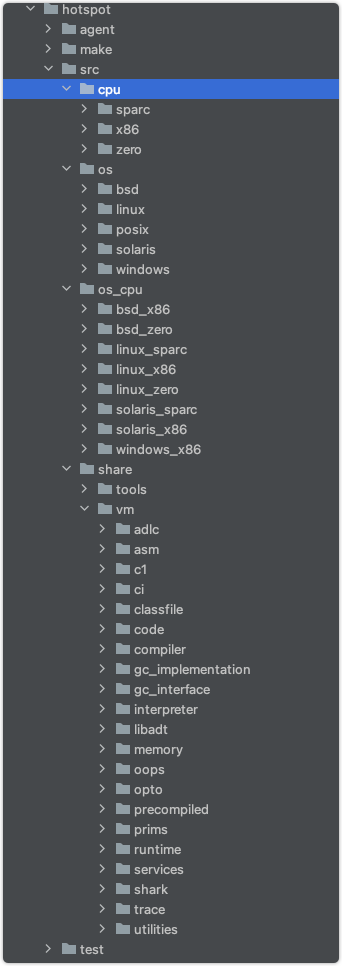

# Hotspot目录结构

以jdk8为例

> 其中cpu、 os 、 os_cpu都是跟平台相关的。具体这里不再赘述。主要是 `share/vm` 目录

## VM目录组件介绍

####`adlc` 一些平台相关的描述文件 
#### `asm` 汇编相关的操作
#### `c1` c1编译器，又名client编译器
#### `ci` 动态编译器
#### `classfile` 字节码相关 
#### `code` 机器码生成
#### `compiler` 动态编译器接口
#### `gc_implementation` gc相关实现
#### `gc_interface` gc相关接口
#### `interpreter` 解释器
#### `libadt` 抽象的数据结构
#### `memory` 内存操作相关
#### `oops` 面向对象oop模型相关(klass/oops)
#### `opto` c2编译器
#### `precompiled` 预编译头文件相关
#### `prims` Hotspot堆外接口
#### `runtime` 运行时相关
#### `services` jmx相关
#### `shark` llvm实现的即时编译器
#### `trace` 统计相关
#### `utilities` 内部工具

