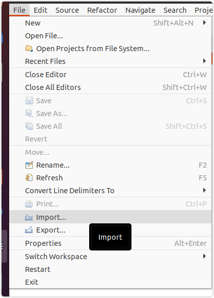
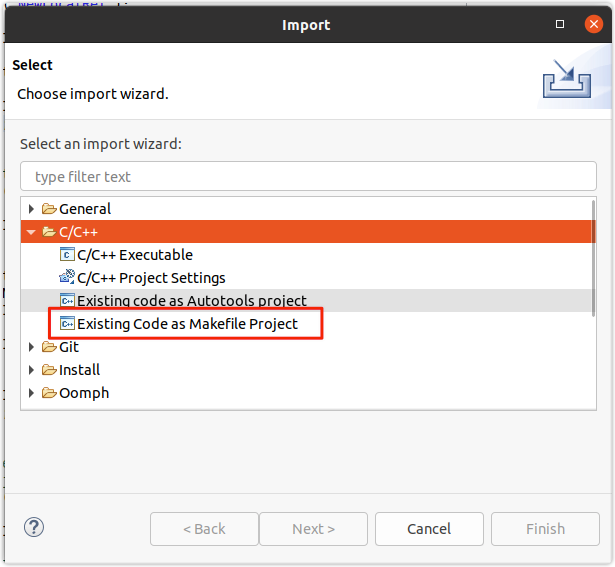
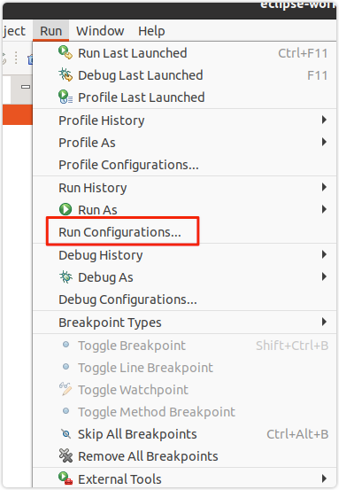
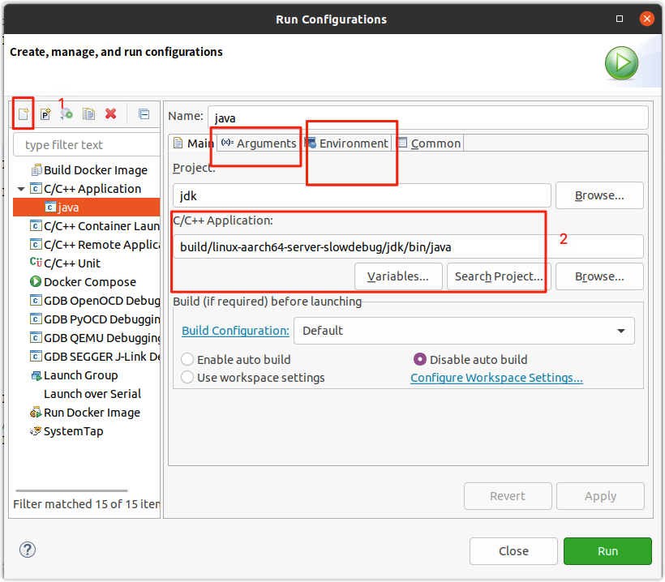

# IDE调试配置教程

## 1. IDE列表 
    1. Eclipse
    2. JetBrains Clion
    3. NetBeans

### 1.1 Eclipse

#### 简介: 
Eclipse是著名的跨平台的自由集成开发环境（IDE）。最初主要用来Java语言开发，但是目前亦有人通过插件使其作为其他计算机语言比如C++和Python的开发工具。

所以安装eclipse时请务必安装好jdk~

接下来根据对应的平台选择对应的版本。这里不再赘述
> 下载地址: [点此进入](https://www.eclipse.org/downloads/packages/)

安装完毕后开启eclipse， 选择import 你编译好的openjdk

选择c/c++项目

选择导入即可。

接下来配置运行命令

创建调试选项配置，然后将应用程序选择为你自己编译好的路径。在 `argument` 标签中加入你要执行的主类 (可以是任意带main方法的类)

在 `environment` 标签中配置对应的classpath路径。是kv结构的。主要让ide顺利的找到你的主类 

如上所述配置完成之后即可享受你的debug之旅~

