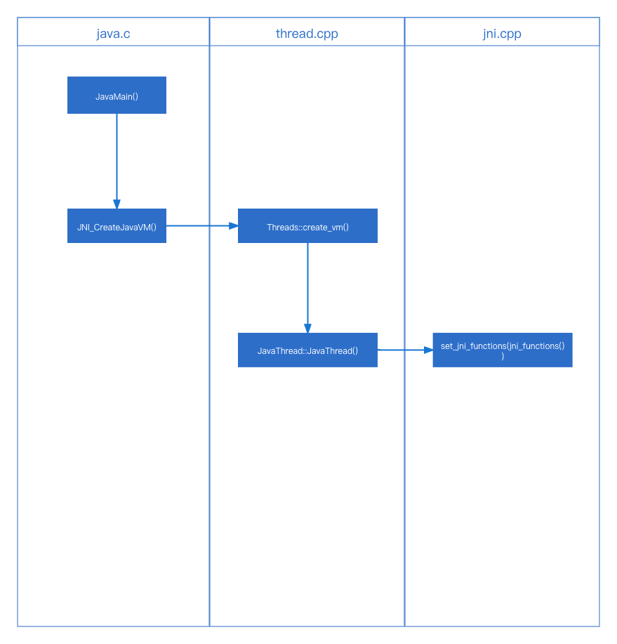

# JNI 初始化篇

> 接JVM初始化篇, 如果没有看过启动篇请先阅读一下启动篇。否则直接看的话比较容易懵逼~

## JNI简介

jni相关的类文件都在 `hotspot/src/share/vm/prims` 中，后续会出一篇目录结构简介的文章。此处先不介绍， 就记住在那里就行~

[JVM启动流程](../start/README.md)

在JVM启动流程中介绍过，会赋值ifn的三个函数首地址, 分别是 `CreateJavaVM`、 `GetDefaultJavaVMInitArgs` 、`GetCreatedJavaVMs`.

然后会在 `JNI_CreateJavaVM()` 中对 JNIEnv赋值。
```c++

  result = Threads::create_vm((JavaVMInitArgs*) args, &can_try_again);
  if (result == JNI_OK) {
    JavaThread *thread = JavaThread::current();
    /* thread is thread_in_vm here */
    // jni_InvokeInterface 赋值。c语言环境中使用改变量。c++ 环境中使用JNIEnv
    *vm = (JavaVM *)(&main_vm); // main_vm定义在下面
    // JNIEnv赋值。 由此处可以看出，JNIEnv其实是线程私有的。
    *(JNIEnv**)penv = thread->jni_environment();
    ...
```

`struct JavaVM_ main_vm = {&jni_InvokeInterface};`

### `JNIEnv` 的初始化过程
1. `JavaMain() java.c`
2. -> `InitializeJVM() java.c`
3. -> `JNI_CreateJavaVM() jni.cpp`
4. -> `Threads::create_vm()       thread.cpp`
5. -> `JavaThread::JavaThread()   thread.cpp`
6. -> `JavaThread::initialize()   thread.cpp`
7. -> `jni_functions() jni.cpp`

#### 1. 使用 `pthread_create` 回调 `JavaMain()` 参考 [8. ContinueInNewThread0() 函数](../start/README.md "8. ContinueInNewThread0() 函数")
```c++
/* Initialize the virtual machine */
    start = CounterGet();
    if (!InitializeJVM(&vm, &env, &ifn)) {
        JLI_ReportErrorMessage(JVM_ERROR1);
        exit(1);
    }
    ...
```
#### 2. `InitializeJVM()` 
```c++
    // _JAVA_LAUNCHER_DEBUG=true
    if (JLI_IsTraceLauncher()) {
        int i = 0;
        printf("JavaVM args:\n    ");
        printf("version 0x%08lx, ", (long)args.version);
        printf("ignoreUnrecognized is %s, ",
        args.ignoreUnrecognized ? "JNI_TRUE" : "JNI_FALSE");
        printf("nOptions is %ld\n", (long)args.nOptions);
        for (i = 0; i < numOptions; i++)
        printf("    option[%2d] = '%s'\n",
        i, args.options[i].optionString);
    }
    r = ifn->CreateJavaVM(pvm, (void **)penv, &args);
```
`r = ifn->CreateJavaVM(pvm, (void **)penv, &args);` [链接ifn参数](../start/README.md "#5. 当 `libjvm.so` 动态链接库加载完成后接下来会调用")
#### 3. `JNI_CreateJavaVM()`
调用 `hotspot/src/share/vm/prims/jni.cpp` `JNICALL JNI_CreateJavaVM(JavaVM **vm, void **penv, void *args)`
```c++
    if (Atomic::xchg(1, &vm_created) == 1) {
        return JNI_EEXIST;   // already created, or create attempt in progress
    }
    if (Atomic::xchg(0, &safe_to_recreate_vm) == 0) {
        return JNI_ERR;  // someone tried and failed and retry not allowed.
    }
    // ...
    result = Threads::create_vm((JavaVMInitArgs*) args, &can_try_again);
    if (result == JNI_OK) {
    JavaThread *thread = JavaThread::current();
    /* thread is thread_in_vm here */
    *vm = (JavaVM *)(&main_vm);
    *(JNIEnv**)penv = thread->jni_environment();
    
    // Tracks the time application was running before GC
    RuntimeService::record_application_start();
    
    // Notify JVMTI
    if (JvmtiExport::should_post_thread_life()) {
    JvmtiExport::post_thread_start(thread);
    }
    
    EventThreadStart event;
    if (event.should_commit()) {
    event.set_javalangthread(java_lang_Thread::thread_id(thread->threadObj()));
    event.commit();
    }
    // ...
```
#### 4. `Threads::create_vm()`
位于 `src/hotspot/share/runtime/thread.cpp`

```c++
// ...

// Attach the main thread to this os thread
  JavaThread* main_thread = new JavaThread();
  main_thread->set_thread_state(_thread_in_vm);
  main_thread->initialize_thread_current();
  // must do this before set_active_handles
  main_thread->record_stack_base_and_size();
  main_thread->register_thread_stack_with_NMT();
  main_thread->set_active_handles(JNIHandleBlock::allocate_block());
  MACOS_AARCH64_ONLY(main_thread->init_wx());

  if (!main_thread->set_as_starting_thread()) {
    vm_shutdown_during_initialization(
                                      "Failed necessary internal allocation. Out of swap space");
    main_thread->smr_delete();
    *canTryAgain = false; // don't let caller call JNI_CreateJavaVM again
    return JNI_ENOMEM;
  }
  
  // ...
```
#### 5. `JavaThread::JavaThread()`
`JavaThread* main_thread = new JavaThread();` 会触发 `JavaThread::JavaThread()` 的构造函数调用。

#### 6. `JavaThread::initialize()`
```c++
//...
set_jni_functions(jni_functions());
// ...
```
#### 7. `jni_functions()`
`set_jni_functions(jni_functions());` 设置一堆初始化属性， 然后设置jni对应的方法。
`jni_functions()` 所对应的数组
```c++
jni_NativeInterface = {
    NULL,
    NULL,
    NULL,

    NULL,

    jni_GetVersion,

    jni_DefineClass,
    jni_FindClass,

    jni_FromReflectedMethod,
    jni_FromReflectedField,

    jni_ToReflectedMethod,

    jni_GetSuperclass,
    jni_IsAssignableFrom,

    jni_ToReflectedField,

    jni_Throw,
    jni_ThrowNew,
    // ...
```

## 流程图

