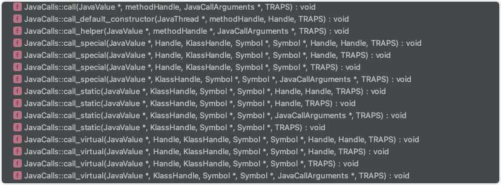

# Java方法调用过程

## 简介
> JavaCalls是本地代码执行Java方法调用的一个工具类，会创建一个新的栈帧，做必要的栈帧切换工作，保证新的栈帧与原有的栈帧被正确的链接起来。JavaCalls继承自AllStatic类，其定义位于hotspot/src/share/vm/runtime/javaCalls.hpp中，它的方法都是可以直接调用的静态方法，如下图： 

源码位置: `hotspot/src/share/vm/runtime/javaCalls.cpp`

参考文献: https://blog.csdn.net/qq_31865983/article/details/102877069