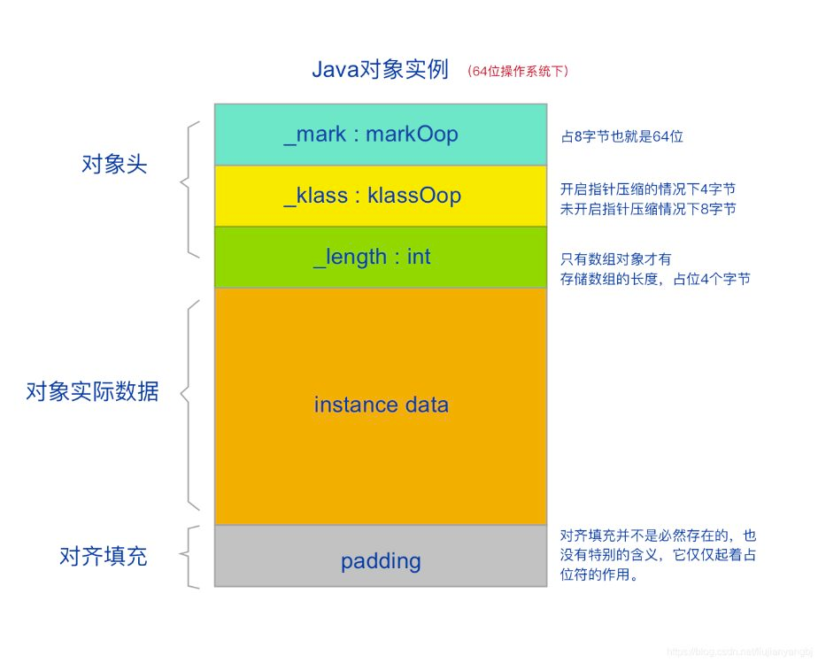
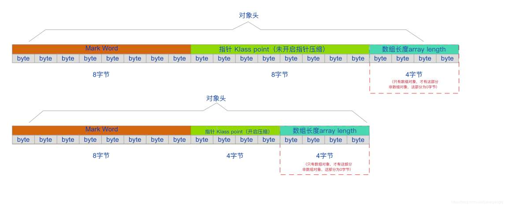
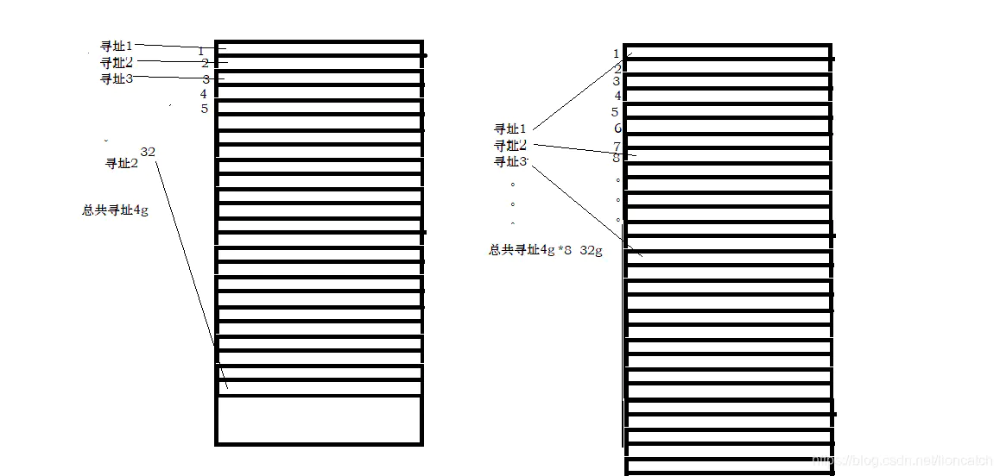

# CompressedOops 指针压缩技术(X64系统)

> 指针压缩技术是针对64位系统的。在 `oop` 模型下，定义的 `java` 对象(`oop`对象) 和 class对象 (`instanceKlass` 对象) 的关系是
> 
> `oop` 对象中 除去对象头、填充值和字段数据(成员变量)之外还要存储 `klass` 对象对应的指向。方便获取对应类型。同时，`klass` 对象中还存放着与 `oop` 对象关联度很高的很多属性和操作方法(多态表，`vtable`、`itable`)。
## JAVA对象布局

## JVM是怎么实现指针压缩的
参考此篇: [OOP-KLASS 二分模型](OOP.md)

> 默认对象按8字节对齐时, 压缩指针大约可以寻址 `32G` 的 Java 堆。超过这个范围时, 默认压缩模式可能无法继续使用; 但实际是否可用还和堆基址、对象对齐参数 `ObjectAlignmentInBytes`、JDK版本等因素有关, 不能简单理解为所有 JVM 内存超过 32G 都必然失效。

32位操作系统 花费的内存空间为: 
> 对象头-8字节 + 实例数据 int类型-4字节 + 引用类型-4字节+补充0字节(16是8的倍数) 16个字节

64位操作系统
> 对象头-16字节 + 实例数据 int类型-4字节 + 引用类型-8字节+补充4字节(28不是8的倍数补充4字节到达32字节) 32个字节

同样的对象需要将近两倍的容量,(实际平均1.5倍),所以需要开启压缩指针:

64位开启压缩指针 
> 对象头-12字节 + 实例数据 int类型-4字节 + 引用类型-4字节+补充0字节=24个字节

## 压缩指针是怎么实现的

JVM的实现方式是: 
> 不再直接用64位机器地址保存普通对象引用, 而是用32位的 `narrow oop` 保存压缩后的偏移值。由于Java对象通常按8字节对齐, 真实地址的低3位通常为0, 因此可以在保存时省略这几位, 使用时再通过移位还原。

> 在常见的零基压缩模式下, 解码过程可以近似理解为 `address = narrow_oop << 3`; 非零基模式下还需要加上 heap base, 即 `address = base + (narrow_oop << shift)`。反过来, 真实地址编码成 `narrow oop` 时会减去基址并右移。这里的关键不是“每隔8字节保存一个引用”, 而是利用对象对齐带来的低位恒为0来节省引用存储空间。

如上也可以解释为什么默认8字节对象对齐时, 压缩指针的典型寻址上限约为32G。

## 哪些信息会被压缩

1. Java堆中的普通对象引用字段
2. 对象数组中的元素引用
3. 部分静态引用字段的存储
4. 对象头中的 Klass 指针在开启 `UseCompressedClassPointers` 时也可以压缩。64位平台下普通对象头常见为 mark word 8字节 + 压缩 klass 指针4字节, 合计12字节, 最终对象大小仍会按对象对齐规则补齐。

## JVM 指针压缩参数
