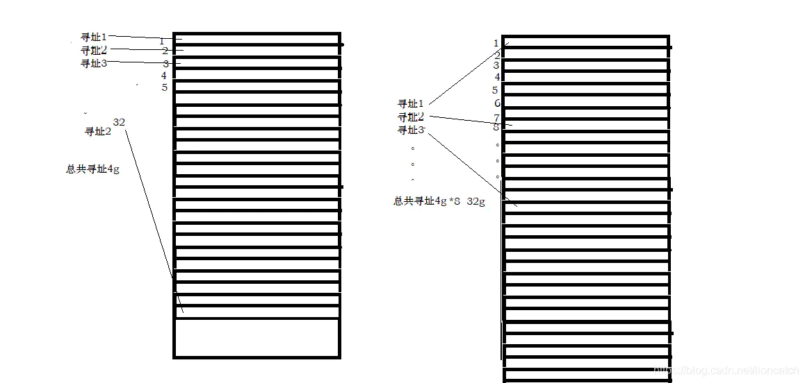

# CompressedOops 指针压缩技术(X64系统)

> 指针压缩技术是针对64位系统的。在 `oop` 模型下，定义的 `java` 对象(`oop`对象) 和 class对象 (`instanceMinorKlass` 对象) 的关系是
> 
> `oop` 对象中 除去对象头、填充值和字段数据(成员变量)之外还要存储 `klass` 对象对应的指向。方便获取对应类型。同时，`klass` 对象中还存放着与 `oop` 对象关联度很高的很多属性和操作方法(多态表，`vtable`、`itable`)。
## JAVA对象布局

## JVM是怎么实现指针压缩的
参考此篇: [OOP-KLASS 二分模型](OOP.md)

> 指针压缩会在JVM `32G` 内存以上失效，原因如下:

32位操作系统 花费的内存空间为: 
> 对象头-8字节 + 实例数据 int类型-4字节 + 引用类型-4字节+补充0字节(16是8的倍数) 16个字节

64位操作系统
> 对象头-16字节 + 实例数据 int类型-4字节 + 引用类型-8字节+补充4字节(28不是8的倍数补充4字节到达32字节) 32个字节

同样的对象需要将近两倍的容量,(实际平均1.5倍),所以需要开启压缩指针:

64位开启压缩指针 
> 对象头-12字节 + 实例数据 int类型-4字节 + 引用类型-4字节+补充0字节=24个字节

## 压缩指针是怎么实现的

JVM的实现方式是: 
> 不再保存所有引用，而是每隔8个字节保存一个引用。例如，原来保存每个引用0、1、2…，现在只保存0、8、16…。因此，指针压缩后，并不是所有引用都保存在堆中，而是以8个字节为间隔保存引用。

>在实现上，堆中的引用其实还是按照0x0、0x1、0x2…进行存储。只不过当引用被存入64位的寄存器时，JVM将其左移3位（相当于末尾添加3个0），例如0x0、0x1、0x2…分别被转换为0x0、0x8、0x10。而当从寄存器读出时，JVM又可以右移3位，丢弃末尾的0。（oop在堆中是32位，在寄存器中是35位，2的35次方=32G。也就是说，使用32位，来达到35位oop所能引用的堆内存空间）

如上也可以解释为什么堆内存大于32G时指针压缩会失效

## 哪些信息会被压缩

1. 对象的全局静态变量(即类属性)
2. 对象头信息:64位平台下，原生对象头大小为16字节，压缩后为12字节
3. 对象的引用类型:64位平台下，引用类型本身大小为8字节，压缩后为4字节
4. 对象数组类型:64位平台下，数组类型本身大小为24字节，压缩后16字节

## JVM 指针压缩参数
