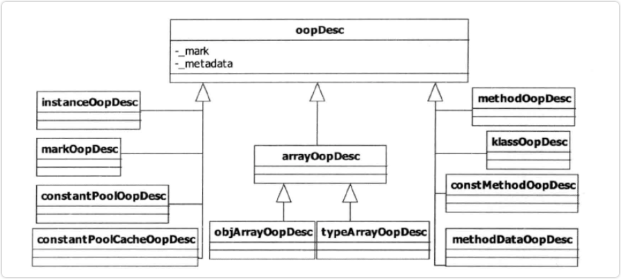
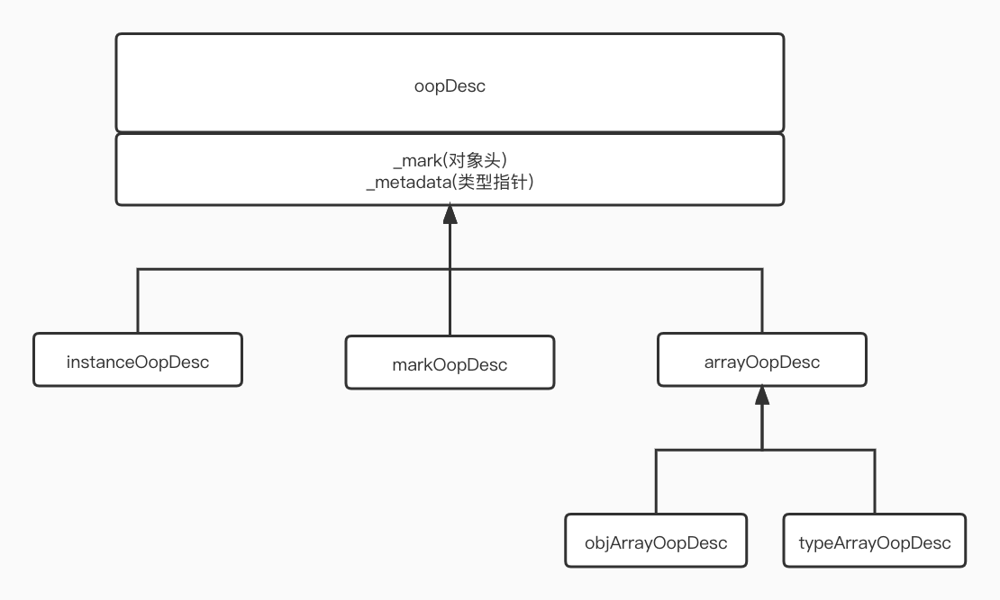

# OOP-KLASS 二分模型

## 1. OOP概念
> 摘自`《Hotspot实战》`
> 
> 设计一个面向对象系统，应当支特面向对象的几个主要特征：封装、继承和至态。在JVM
中必须能够支特这些特征。我们不禁会问：HotSpot 基于 C++实现，而 C++就是一门面向对象
话吉，它本身就具有上述面向对象基本特征，那么只需要在HotSpot 内部为每个 Java 类生成
个C++类，不就行了吗？换句话说，虚拟机行加载一个 Java 类，就在内部创建一个域和方法与
之相同的C++类对等体。当Java 程序需要创建文例对象时，反映到虚拟机中，就在内部创建相
应的 C++对象。
> 
> 
> 事实上，Hotspot 的设计者并没有按照上述思路设计对象表示系统，而是专门设计了OOP-Klass
分模型：

* OOP: ordinary object pointer， 或 OOPS. 即普通对象指针，用来描述对象实例信息
* Klass: Java 类的 C++对等体，用来描达 Java 类

### 1. OOP 模型
1. 类结构图</br>
jdk 1.7及以下版本结构图(摘自 `Hotspot` 实战)


jdk1.8及以上版本结构图


2. OOP模型对应代码

源码位置: `hotspot/src/share/vm/oops/oop.hpp`
```c++
class oopDesc {
private:
  volatile markOop  _mark; // markOopDesc* markOop
  
  union _metadata {
    Klass*      _klass;
    narrowKlass _compressed_klass; // juint  narrowKlass
  } _metadata;
};
```
3. 代码详解

`union` 关键字含义:
* `union` 即为联合，它是一种特殊的类。通过关键字`union` 进行定义，一个`union` 可以有多个数据成员。
* 联合体是一种互斥的结构体，也就是说在任意时刻，联合中只能有一个数据成员可以有值。当给联合中某个成员赋值之后，该联合中的其它成员就变成未定义状态了。

简单解释一下
* `markOop` 实际上是markOopDesc指针类型，言外之意就是会随着操作系统的位数决定它的大小。
如x86架构下，指针大小是4字节(Byte), 而64位系统则是8字节。 所以这也就是为什么对象头无法压缩的原因
* 联合体 `_metadata`: 上面也说过联合体是排他的，也就是说同一时刻，只要联合体中的其中一个字段有值，则其它字段都是未定义的状态
* 关于对象指针压缩， 使用 `-XX:(+/-)UseCompressedOops` 来控制是否开启指针压缩。 控制指针压缩的参数如下表格：

|数据类型|参数名称|默认值|参数类型和支持环境|
|   ---|    ---|    ---|    ---|
|bool|UseCompressedOops|true|{lp64_product}|

通过上面的表格可以看出来，这个参数是64位jdk，并且是`product`版本的Hotspot级别的参数(当然，自己编译的debug级别的jdk也是可以的。这里使用级别这个词不太准确，请自行脑补)

指针压缩完后的效果其实是把8字节大小的指针使用int类型(4字节)的结构体来存储。这样的话其实存储的是内存地址，而且是需要往右偏移3位的一段空间地址。
所以取地址时，需要左移3位就可以拿到真正的偏移地址了。这里不再赘述。详情移步到 [4.2 指针压缩](Compressed_Oops.md) 章节

4. 总结

`JVM` 在描述 `JAVA` 类型和类型指针 `JAVA` 方法类型和方法指针，常量池缓存类型指针，基本数据类型和数组类型指针。 `HotSpot` 认为以上这几种模型已经足够描述 `JAVA` 程序的全部： 数据、方法、类型、数组和实例。


### 2. KLASS 模型
Klass结构

源码位置: `src/hotspot/share/oops/instanceKlass.hpp`
> openjdk8 instanceKlass 
```c++
// An InstanceKlass is the VM level representation of a Java class.
// It contains all information needed for at class at execution runtime.

//  InstanceKlass layout:
//    [C++ vtbl pointer           ] Klass
//    [subtype cache              ] Klass
//    [instance size              ] Klass
//    [java mirror                ] Klass
//    [super                      ] Klass
//    [access_flags               ] Klass
//    [name                       ] Klass
//    [first subklass             ] Klass
//    [next sibling               ] Klass
//    [array klasses              ]
//    [methods                    ]
//    [local interfaces           ]
//    [transitive interfaces      ]
//    [fields                     ]
//    [constants                  ]
//    [class loader               ]
//    [source file name           ]
//    [inner classes              ]
//    [static field size          ]
//    [nonstatic field size       ]
//    [static oop fields size     ]
//    [nonstatic oop maps size    ]
//    [has finalize method        ]
//    [deoptimization mark bit    ]
//    [initialization state       ]
//    [initializing thread        ]
//    [Java vtable length         ]
//    [oop map cache (stack maps) ]
//    [EMBEDDED Java vtable             ] size in words = vtable_len
//    [EMBEDDED nonstatic oop-map blocks] size in words = nonstatic_oop_map_size
//      The embedded nonstatic oop-map blocks are short pairs (offset, length)
//      indicating where oops are located in instances of this klass.
//    [EMBEDDED implementor of the interface] only exist for interface
//    [EMBEDDED host klass        ] only exist for an anonymous class (JSR 292 enabled)
```

主要标注 `klass` 的几种状态。
```c++
  // See "The Java Virtual Machine Specification" section 2.16.2-5 for a detailed description
  // of the class loading & initialization procedure, and the use of the states.
  enum ClassState {
    allocated,                          // allocated (but not yet linked)
    loaded,                             // loaded and inserted in class hierarchy (but not linked yet)
    linked,                             // successfully linked/verified (but not initialized yet)
    being_initialized,                  // currently running class initializer
    fully_initialized,                  // initialized (successfull final state)
    initialization_error                // error happened during initialization
  };
```
